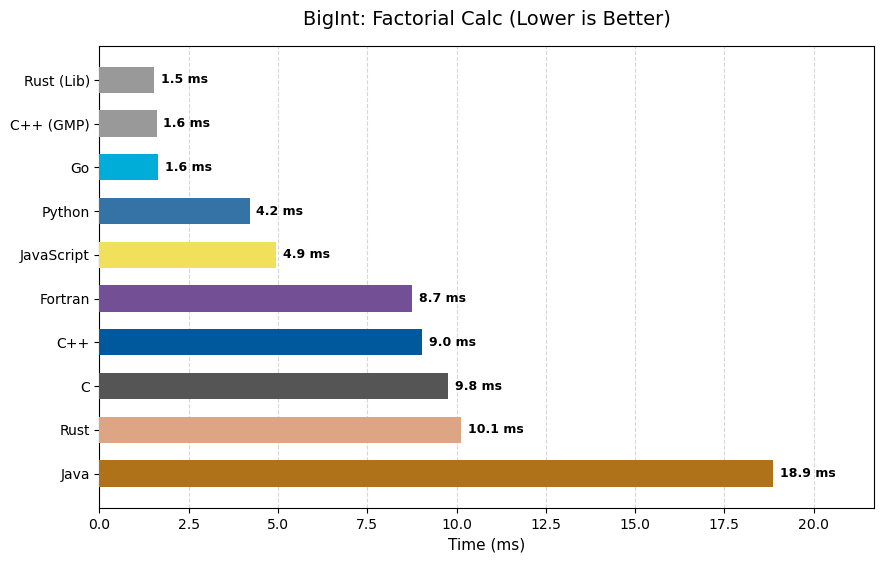
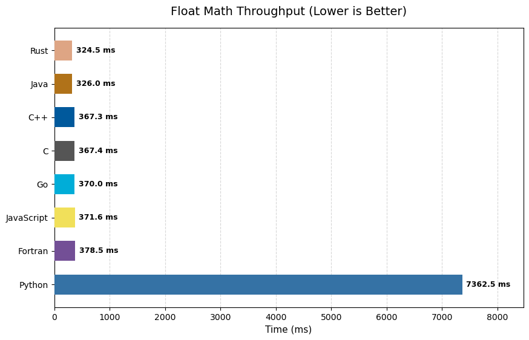
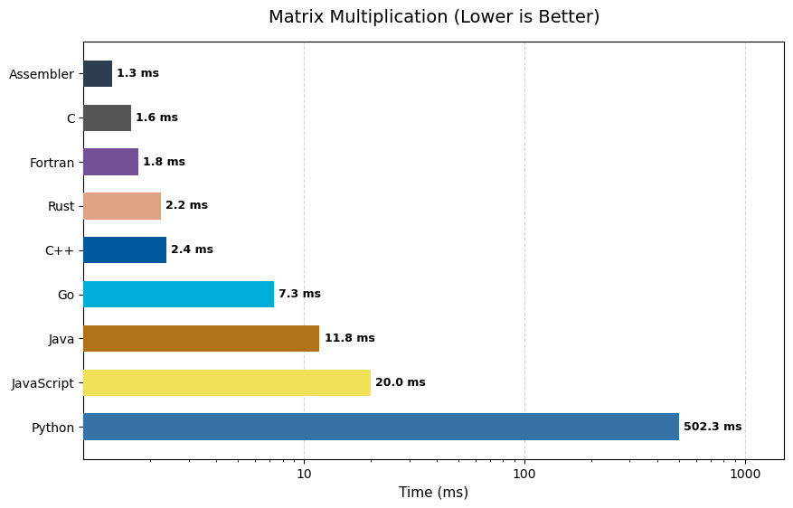
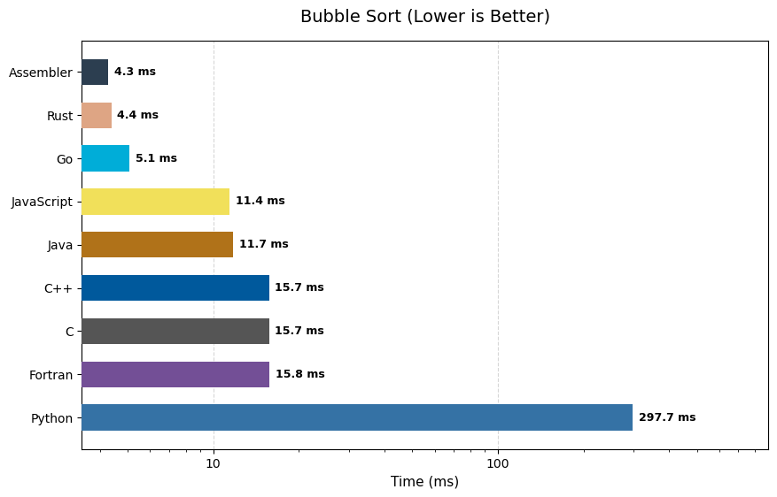

# Polyglot Benchmark Results

Generated on: 2026-01-26 04:52:46

## BigInt Performance

| Language | Factorial | Rel Speed | Fibonacci | Power | Type |
| :--- | :--- | :--- | :--- | :--- | :--- |
| **Rust (Lib)** | 1.539 ms | 1.00x | 3.547 ms | 0.006 ms | num-bigint |
| **C++ (GMP)** | 1.601 ms | 1.04x | 3.242 ms | 0.005 ms | GMP Lib |
| **Go** | 1.646 ms | 1.07x | 7.206 ms | 0.019 ms | math/big |
| **Python** | 4.206 ms | 2.73x | 6.248 ms | 0.036 ms | Native |
| **JavaScript** | 4.940 ms | 3.21x | 7.057 ms | 0.086 ms | BigInt |
| **Fortran** | 8.749 ms | 5.68x | 17.271 ms | 1.072 ms | Custom Base 10^9 |
| **C++** | 9.032 ms | 5.87x | 18.384 ms | 1.059 ms | Custom Base 10^9 |
| **C** | 9.766 ms | 6.35x | 43.339 ms | 1.228 ms | Custom Base 10^9 |
| **Rust** | 10.118 ms | 6.57x | 25.003 ms | 1.173 ms | Custom Base 10^9 |
| **Java** | 18.872 ms | 12.26x | 19.302 ms | 0.016 ms | BigInteger |

---

## Float Throughput

| Language | Time | Rel Speed |
| :--- | :--- | :--- |
| **Rust** | 324.538 ms | 1.00x |
| **Java** | 325.961 ms | 1.00x |
| **C++** | 367.264 ms | 1.13x |
| **C** | 367.383 ms | 1.13x |
| **Go** | 370.000 ms | 1.14x |
| **JavaScript** | 371.588 ms | 1.14x |
| **Fortran** | 378.526 ms | 1.17x |
| **Python** | 7362.509 ms | 22.69x |

---

## Matrix Multiplication

| Language | Time | Rel Speed |
| :--- | :--- | :--- |
| **Assembler** | 1.348 ms | 1.00x |
| **C** | 1.645 ms | 1.22x |
| **Fortran** | 1.774 ms | 1.32x |
| **Rust** | 2.241 ms | 1.66x |
| **C++** | 2.380 ms | 1.77x |
| **Go** | 7.281 ms | 5.40x |
| **Java** | 11.776 ms | 8.74x |
| **JavaScript** | 20.030 ms | 14.86x |
| **Python** | 502.302 ms | 372.63x |

---

## Bubble Sort

| Language | Time | Rel Speed |
| :--- | :--- | :--- |
| **Assembler** | 4.274 ms | 1.00x |
| **Rust** | 4.381 ms | 1.03x |
| **Go** | 5.074 ms | 1.19x |
| **JavaScript** | 11.381 ms | 2.66x |
| **Java** | 11.718 ms | 2.74x |
| **C++** | 15.688 ms | 3.67x |
| **C** | 15.689 ms | 3.67x |
| **Fortran** | 15.758 ms | 3.69x |
| **Python** | 297.723 ms | 69.66x |

---

